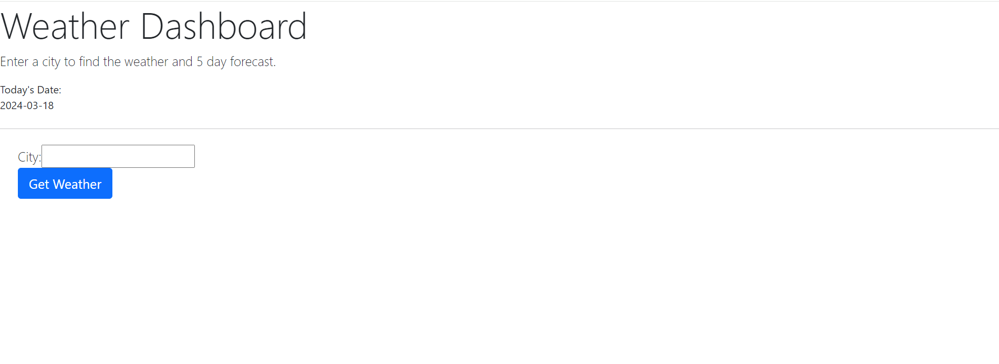
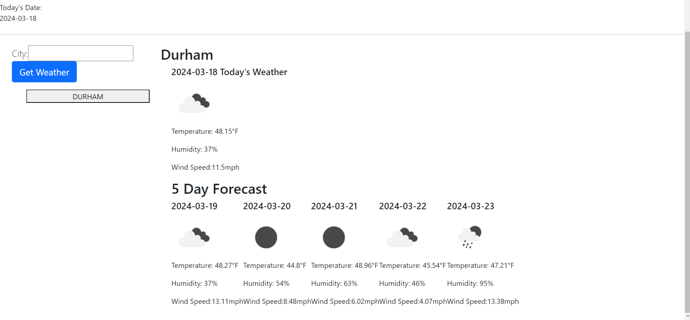
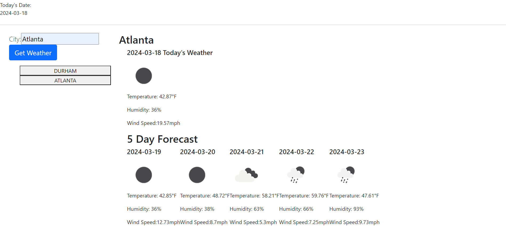

# weather-dashboard

## Description

This application is used to search current and future weather conditions for a searched city. 

## Installation

Browser with local storage is required.
Click the link below to view page.
https://jinkc21.github.io/weather-dashboard/

## Usage

The page starts with the current date as well as an input field. 

To search for a city's weather forecast, a city name must be inputted in the city search box. After clicking "Get Weather", the current weather and 5 day forecast will be displayed. 

A search history is also created that allows users to get the specific infomation for the recently searched city. 

## Credits

Openweathermap API was used heavily. They provided the API as well as a tutorial to create this application. 
https://openweathermap.org/
https://coding-boot-camp.github.io/full-stack/apis/how-to-use-api-keys

## License

MIT License

Copyright (c) 2024 jinkc21

Permission is hereby granted, free of charge, to any person obtaining a copy
of this software and associated documentation files (the "Software"), to deal
in the Software without restriction, including without limitation the rights
to use, copy, modify, merge, publish, distribute, sublicense, and/or sell
copies of the Software, and to permit persons to whom the Software is
furnished to do so, subject to the following conditions:

The above copyright notice and this permission notice shall be included in all
copies or substantial portions of the Software.

THE SOFTWARE IS PROVIDED "AS IS", WITHOUT WARRANTY OF ANY KIND, EXPRESS OR
IMPLIED, INCLUDING BUT NOT LIMITED TO THE WARRANTIES OF MERCHANTABILITY,
FITNESS FOR A PARTICULAR PURPOSE AND NONINFRINGEMENT. IN NO EVENT SHALL THE
AUTHORS OR COPYRIGHT HOLDERS BE LIABLE FOR ANY CLAIM, DAMAGES OR OTHER
LIABILITY, WHETHER IN AN ACTION OF CONTRACT, TORT OR OTHERWISE, ARISING FROM,
OUT OF OR IN CONNECTION WITH THE SOFTWARE OR THE USE OR OTHER DEALINGS IN THE
SOFTWARE.

---